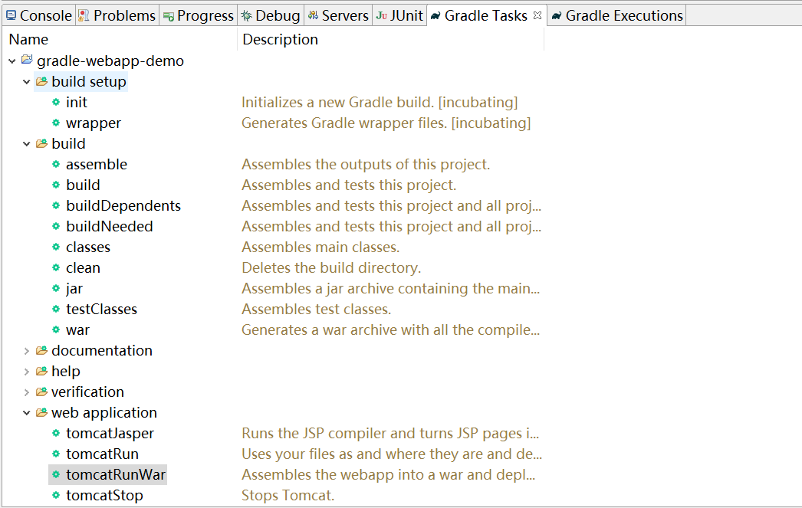
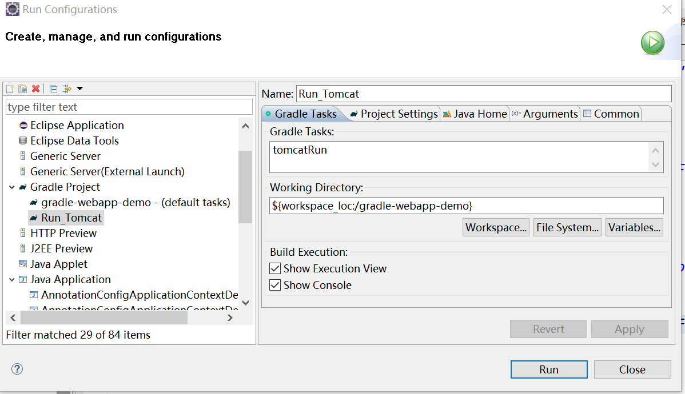

[gradle offical](https://gradle.org/)  
[Gradle cn](http://www.yiibai.com/gradle/)   
[Gradle User Guide](http://wiki.jikexueyuan.com/project/GradleUserGuide-Wiki/)  
[groovy offical](http://www.groovy-lang.org/)  
[Groovy cn](https://www.w3cschool.cn/groovy)  
[github bulidship](https://github.com/eclipse/buildship/blob/master/docs/user/Installation.md)
# 引言
* [定义全局变量](#定义全局变量)
* [运行web项目](#运行web项目)   
此项目用于测试gradle管理web项目。在创建gradle项目后，在 *src/main* 文件夹中，需要创建2个子文件夹，分别为 *resources* 和 *webapp*。
    * src/main/java: 此文件夹中存放 java 源文件代码。
    * src/main/resources: 此文件夹中可以存放属性文件和其他资源。
    * src/main/webapp: 此文件夹包含jsp和其他Web应用程序内容。

## 定义全局变量
在使用gradle管理项目的时候，我们有时候需要对jar的版本进行统一的管理，这是我们可以定义全局变量，形式如下：  

```
ext.springVersion = '4.3.13.RELEASE'
```
或者
```
def springVersion = '4.3.13.RELEASE'
```

jar依赖声明如下：
```
dependencies {
    compile "org.springframework:spring-beans:${springVersion}"
    compile "org.springframework:spring-context:${springVersion}"
    compile "org.springframework:spring-context-support:${springVersion}"
    compile "org.springframework:spring-web:${springVersion}"
    compile "org.springframework:spring-webmvc:${springVersion}"
    compile "org.springframework:spring-jdbc:${springVersion}"
    compile "org.springframework:spring-orm:${springVersion}"
}
```

我们也可以在相关依赖中，使用 *def* 定义局部变量，具体如下：
```
dependencies {
	def springVersion = '4.3.13.RELEASE'
    compile "org.springframework:spring-beans:${springVersion}"
    compile "org.springframework:spring-context:${springVersion}"
    compile "org.springframework:spring-context-support:${springVersion}"
    compile "org.springframework:spring-web:${springVersion}"
    compile "org.springframework:spring-webmvc:${springVersion}"
    compile "org.springframework:spring-jdbc:${springVersion}"
    compile "org.springframework:spring-orm:${springVersion}"
}
```
需要注意的一点，在引用变量的时候，jar包group，name，version声明必须以应为 *""* 括起来，否则刷新项目，jar依赖不能够解决。

在构建项目时我们也可以使用maven仓库寻找jar，仓库声明如下：
```
repositories {
        mavenLocal()
        mavenCentral()
    	maven{ url 'http://maven.aliyun.com/nexus/content/groups/public/'}
    }
```
上述修改，只能针对当前项目，如果要对所有项目生效可以参考如下文章配置：
[Gradle 修改Maven仓库地址](http://blog.csdn.net/thousa_ho/article/details/73013729)  

## 运行web项目
1. 在 Eclipse 菜单中 Window -> Show View -> Other... -> Gradle -> Gradle Tasks 打开 *Gradle任务*，
右键单击 *build* 并选择 *Run Gradle Tasks* 执行任务。

2. 在项目名称上点击右键，在弹出的菜单选项中选择 Run As -> Run Configurations... 在弹出的界面中选择 *New*，输入以下几个内容：
* Name: tomcatRun
* Gradle Tasks: tomcatRun
* Working Directory: ${workspace_loc:/gradle-webapp-demo},如有必要，还需要指定 Gradle和JDK的安装的目录.
具体如下图：

执行tomcatRun配置，控制输出：

```
Working Directory: F:\github\gradle-webapp-demo
Gradle User Home: D:\.gradle
Gradle Distribution: Local installation at D:\gradle-3.1
Gradle Version: 3.1
Java Home: D:\JDK8
JVM Arguments: None
Program Arguments: None
Build Scans Enabled: false
Offline Mode Enabled: false
Gradle Tasks: tomcatRun

:compileJava UP-TO-DATE
:processResources UP-TO-DATE
:classes UP-TO-DATE
:tomcatRun
Started Tomcat Server
The Server is running at http://localhost:8080/gradle-webapp-demo
```
访问 http://localhost:8080/gradle-webapp-demo 即可。  
另外也可以直接执行直接执行Gradle Tasks->web apllication->tomcatRun 任务，效果一样，不同的是，不可以配置jdk及JVM相关参数。

## 附
gradle tasks视图中的任务，我们也可以在命令行使用 *gradle tasks* 查看项目的任务：
```
donald@donaldHP MINGW64 /f/github/gradle-webapp-demo (master)
$ gradle tasks
:tasks

------------------------------------------------------------
All tasks runnable from root project
------------------------------------------------------------

Build tasks
-----------
assemble - Assembles the outputs of this project.
build - Assembles and tests this project.
buildDependents - Assembles and tests this project and all projects that depend on it.
buildNeeded - Assembles and tests this project and all projects it depends on.
classes - Assembles main classes.
clean - Deletes the build directory.
jar - Assembles a jar archive containing the main classes.
testClasses - Assembles test classes.
war - Generates a war archive with all the compiled classes, the web-app content and the libraries.

Build Setup tasks
-----------------
init - Initializes a new Gradle build. [incubating]
wrapper - Generates Gradle wrapper files. [incubating]

Documentation tasks
-------------------
javadoc - Generates Javadoc API documentation for the main source code.

Help tasks
----------
buildEnvironment - Displays all buildscript dependencies declared in root project 'gradle-webapp-demo'.
components - Displays the components produced by root project 'gradle-webapp-demo'. [incubating]
dependencies - Displays all dependencies declared in root project 'gradle-webapp-demo'.
dependencyInsight - Displays the insight into a specific dependency in root project 'gradle-webapp-demo'.
help - Displays a help message.
model - Displays the configuration model of root project 'gradle-webapp-demo'. [incubating]
projects - Displays the sub-projects of root project 'gradle-webapp-demo'.
properties - Displays the properties of root project 'gradle-webapp-demo'.
tasks - Displays the tasks runnable from root project 'gradle-webapp-demo'.

Verification tasks
------------------
check - Runs all checks.
test - Runs the unit tests.

Web application tasks
---------------------
tomcatJasper - Runs the JSP compiler and turns JSP pages into Java source.
tomcatRun - Uses your files as and where they are and deploys them to Tomcat.
tomcatRunWar - Assembles the webapp into a war and deploys it to Tomcat.
tomcatStop - Stops Tomcat.

Rules
-----
Pattern: clean<TaskName>: Cleans the output files of a task.
Pattern: build<ConfigurationName>: Assembles the artifacts of a configuration.
Pattern: upload<ConfigurationName>: Assembles and uploads the artifacts belonging to a configuration.

To see all tasks and more detail, run gradle tasks --all

To see more detail about a task, run gradle help --task <task>

BUILD SUCCESSFUL

Total time: 3.892 secs
```
从任务列表输出来看，与gradle tasks视图中的任务中的任务一样。
适应命令 *gradle clean* 执行clean任务，可以删除build生成的资源：

```
donald@donaldHP MINGW64 /f/github/gradle-webapp-demo (master)
$ gradle clean
:clean

BUILD SUCCESSFUL

Total time: 3.031 secs

donald@donaldHP MINGW64 /f/github/gradle-webapp-demo (master)
```
